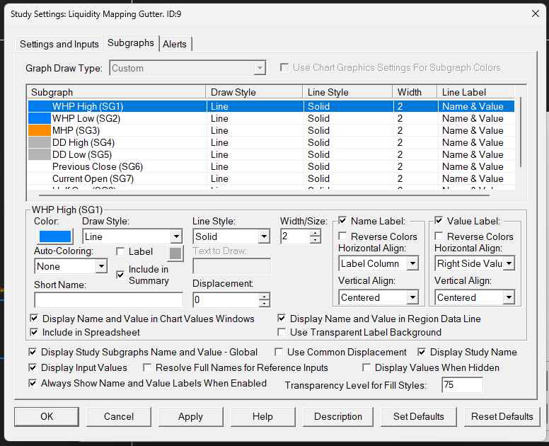

# 🚀 Rocker Scooter Liquidity Map Study for Sierra Chart

A Sierra Chart custom study that displays key liquidity levels in the Rocker Scooter trading style, including Weekly High/Low Hedge Pressure (WHP), Monthly Hedge Pressure (MHP), DD band levels (DD), and session-based reference levels (Open, Close, and Half Gap).

## ✨ Features

### 🎯 Core Liquidity Levels
- **WHP High/Low**: Weekly High/Low Hedge Pressure levels (blue lines)
- **MHP**: Monthly Hedge Pressure level (orange line)
- **DD High/Low**: DD bands levels calculated as Previous Close ± Risk Interval (gray lines)

### 📊 Session Reference Levels
- **Previous Close**: Previous trading day's closing price (white line)
- **Current Open**: Current session's opening price (white line)
- **Half Gap**: Midpoint between Previous Close and Current Open (gray line - dashed if OpenGL mode is on)

(and of course, feel free to adjust these colors, widths, and styles in the settings!)

### ⚙️ Configuration Options
- Manual price entry mode for all levels
- Configurable session start/end times
- Risk interval adjustment for DD levels
- Individual level visibility toggles
- Update frequency control (new day only vs. continuous)
- Use Manual Prices (Set Open / Close manually)

## 🔧 Installation & Compilation

### 🏗️ Using Sierra Chart's Remote Build - Standard

1. **📁 Place the source file**:
   - Copy `rs-liquiditymap.cpp` to your Sierra Chart `ACS_Source` folder
   - Default location: `C:\SierraChart\ACS_Source\`

2. **🔨 Compile using Remote Build**:
   - In Sierra Chart, go to **Analysis** → **Studies** → **Advanced Custom Studies**
   - Click **Build** → **Remote Build - Standard**
   - Select `rs-liquiditymap.cpp` from the file list
   - Click **Build Selected File**
   - Wait for compilation to complete

3. **📈 Apply the study**:
   - Go to **Analysis** → **Studies**
   - Click **Add Custom Study**
   - Select "Liquidity Map" from the list
   - Configure your desired settings

## ⚙️ Configuration

### 🔄 Manual vs Auto Mode
- **Auto Mode** (default): Automatically detects previous close and current open based on session times
- **Manual Mode**: Use manually entered prices for previous close and current open

### 🎛️ Key Settings
- **WHP High/Low**: Enter your weekly high/low hedge pressure levels
- **MHP**: Enter your monthly Hedge Pressure level
- **Risk Interval (DD)**: Distance in points/ticks for DD band levels (default: 50)
- **Session Start/End Time**: Define your trading session (default: 9:30 AM - 4:00 PM)

### 🖼️ Subgraph Settings
For optimal display, configure the subgraph settings as shown in the image below:

## ⚠️ Known Issues & TODO

🚨 **IMPORTANT NOTE**: There are currently issues with the Open and Close level detection logic but you can just set them manually as a work around.

### 🤝 Contributing
If you can fix the Open/Close detection logic, **pull requests are welcome!** The main issues are in the auto-detection section of the code around lines 80-140.

## 📋 Study Parameters

| Parameter | Description | Default |
|-----------|-------------|---------|
| WHP High | Weekly High Hedge Pressure level | 0 |
| WHP Low | Weekly Low High Hedge Pressure level | 0 |
| MHP | Monthly Hedge Pressure level | 0 |
| Risk Interval (DD) | DD band distance | 50 |
| Session Start Time | Trading session start | 9:30 AM |
| Session End Time | Trading session end | 4:00 PM |
| Show Previous Close | Display previous close line | Yes |
| Show Current Open | Display current open line | Yes |
| Show Half Gap | Display half gap line | Yes |
| Update Only on New Trading Day | Limit updates to new days | No |
| Use Manual Prices | Enable manual price entry | No |
| Manual Previous Close | Manual previous close value | 0 |
| Manual Current Open | Manual current open value | 0 |

## 📄 License

This study is provided as-is for educational and trading purposes. Use at your own risk.
